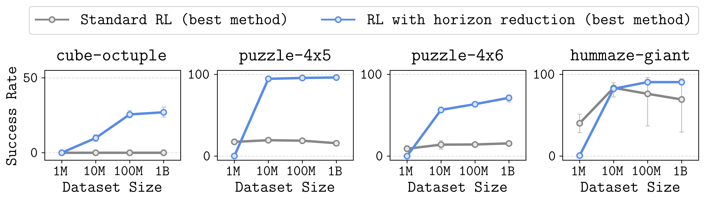

<div align="center">

<div id="user-content-toc" style="margin-bottom: 50px">
  <ul align="center" style="list-style: none;">
    <summary>
      <h1>Horizon Reduction Makes RL Scalable</h1>
      <br>
      <h2><a href="https://arxiv.org/abs/2506.04168">Paper</a></h2>
    </summary>
  </ul>
</div>



</div>

## Overview

This repository contains implementations of five horizon reduction techniques and five baseline algorithms for offline goal-conditioned RL.
It also supports the 1B-sized OGBench datasets as well as the `oraclerep` environments used in the paper.
The supported (goal-conditioned) offline RL algorithms are as follows:

* Standard offline RL
    * **[Flow behavioral cloning (flow BC)](agents/gcfbc.py)**
    * **[Implicit Q-learning (IQL)](agents/gciql.py)**
    * **[Contrastive reinforcement learning (CRL)](agents/crl.py)**
    * **[Soft actor-critic + behavioral cloning (SAC+BC)](agents/gcsacbc.py)**
    * **[Flow Q-learning (FQL)](agents/gcfql.py)**
* Offline RL with horizon reduction
    * **[n-step soft actor-critic + behavioral cloning (n-step SAC+BC)](agents/ngcsacbc.py)**
    * **[Hierarchical flow behavioral cloning (hierarchical flow BC)](agents/hgcfbc.py)**
    * **[Hierarchical implicit Q-learning (HIQL)](agents/hiql.py)**
    * **[SHARSA](agents/sharsa.py)** (ours)
    * **[Double SHARSA](agents/dsharsa.py)** (ours)

## Installation

This repository requires Python 3.9+ and is based on JAX. The main dependencies are
`jax >= 0.4.26` and `ogbench >= 1.1.3`.
To install the full dependencies, simply run:
```bash
pip install -r requirements.txt
```

## Using large datasets

The paper uses 1B-sized datasets for the OGBench environments.
Since the datasets are too large to be hosted, we provide 100M-sized datasets (1/10 of the original size),
which we found to be sufficient for most of the tasks.
These datasets can be downloaded with the following commands:
```bash
# cube-octuple-play-100m (100 datasets * 1000 length-1000 trajectories).
wget -r -np -nH --cut-dirs=2 -A "*.npz" https://rail.eecs.berkeley.edu/datasets/ogbench/cube-octuple-play-100m-v0/
# puzzle-4x5-play-100m (100 datasets * 1000 length-1000 trajectories).
wget -r -np -nH --cut-dirs=2 -A "*.npz" https://rail.eecs.berkeley.edu/datasets/ogbench/puzzle-4x5-play-100m-v0/
# puzzle-4x6-play-100m (100 datasets * 1000 length-1000 trajectories).
wget -r -np -nH --cut-dirs=2 -A "*.npz" https://rail.eecs.berkeley.edu/datasets/ogbench/puzzle-4x6-play-100m-v0/
# humanoidmaze-giant-navigate-100m (25 datasets * 1000 length-4000 trajectories).
wget -r -np -nH --cut-dirs=2 -A "*.npz" https://rail.eecs.berkeley.edu/datasets/ogbench/humanoidmaze-giant-navigate-100m-v0/
```

To use the full 1B-sized datasets, you need to generate them manually.
Generating a 1B-sized dataset requires 1000-1500 CPU hours and 279-551GB of disk space.
To generate datasets, run the commands below.

> [!NOTE]
> To generate datasets for `humanoidmaze-giant`, you first need to download the expert policy and add the `ogbench/impls` directory to `PYTHONPATH` (as stated below).
 
<details>
<summary><b>Click to expand the full list of commands</b></summary>

```bash
# You may parallelize the commands below. Each command takes 1-1.5 hours to finish.

git clone git@github.com:seohongpark/ogbench.git
cd ogbench

# cube-octuple-play-1b (1000 datasets * 1000 length-1000 trajectories).
for i in $(seq -w 0 999); do
    python data_gen_scripts/generate_manipspace.py --seed=$i --env_name=cube-octuple-v0 --save_path=<YOUR_DATA_DIRECTORY>/cube-octuple-play-1b-v0/cube-octuple-play-v0-$i.npz --num_episodes=1000 --max_episode_steps=1001 --dataset_type=play;
done

# puzzle-4x5-play-1b (1000 datasets * 1000 length-1000 trajectories).
for i in $(seq -w 0 999); do
    python data_gen_scripts/generate_manipspace.py --seed=$i --env_name=puzzle-4x5-v0 --save_path=<YOUR_DATA_DIRECTORY>/puzzle-4x5-play-1b-v0/puzzle-4x5-play-v0-$i.npz --num_episodes=1000 --max_episode_steps=1001 --dataset_type=play;
done

# puzzle-4x6-play-1b (1000 datasets * 1000 length-1000 trajectories).
for i in $(seq -w 0 999); do
    python data_gen_scripts/generate_manipspace.py --seed=$i --env_name=puzzle-4x6-v0 --save_path=<YOUR_DATA_DIRECTORY>/puzzle-4x6-play-1b-v0/puzzle-4x6-play-v0-$i.npz --num_episodes=1000 --max_episode_steps=1001 --dataset_type=play;
done

# humanoidmaze-giant-navigate-1b (250 datasets * 1000 length-4000 trajectories).
# (1) Download the expert policies from the OGBench repository.
wget https://rail.eecs.berkeley.edu/datasets/ogbench/experts.tar.gz
tar xf experts.tar.gz && rm experts.tar.gz
# (2) Add the `impls` directory to PYTHONPATH.
export PYTHONPATH="impls:${PYTHONPATH}"  
# (3) Generate datasets.
for i in $(seq -w 0 249); do
    python data_gen_scripts/generate_locomaze.py --seed=$i --env_name=humanoidmaze-giant-v0 --save_path=<YOUR_DATA_DIRECTORY>/humanoidmaze-giant-navigate-1b-v0/humanoidmaze-giant-navigate-v0-$i.npz --num_episodes=1000 --max_episode_steps=4001 --dataset_type=navigate --restore_path=<YOUR_EXPERT_DIRECTORY>/humanoid --restore_epoch=40000000;
done
```

</details>

## Quick start

Our implementations of ten offline goal-conditioned RL algorithms are provided in the `agents` directory.
The default hyperparameters in the code are set based on the `puzzle-4x5` task.
Here are some example commands (see [the section below](#reproducing-the-main-results) for the complete list of commands):
```bash
# SHARSA on puzzle-4x5-play-oraclerep-v0 (1B).
python main.py --env_name=puzzle-4x5-play-oraclerep-v0 --dataset_dir=<YOUR_DATA_DIRECTORY>/puzzle-4x5-play-1b-v0 --agent=agents/sharsa.py
# n-step SAC+BC on puzzle-4x5-play-oraclerep-v0 (1B).
python main.py --env_name=puzzle-4x5-play-oraclerep-v0 --dataset_dir=<YOUR_DATA_DIRECTORY>/puzzle-4x5-play-1b-v0 --agent=agents/ngcsacbc.py
# Hierarchical flow BC on cube-octuple-play-oraclerep-v0 (1B).
python main.py --env_name=cube-octuple-play-oraclerep-v0 --dataset_dir=<YOUR_DATA_DIRECTORY>/cube-octuple-play-1b-v0 --agent=agents/hgcfbc.py --agent.subgoal_steps=50
# Double SHARSA on humanoidmaze-giant-navigate-oraclerep-v0 (1B).
python main.py --env_name=humanoidmaze-giant-navigate-oraclerep-v0 --dataset_dir=<YOUR_DATA_DIRECTORY>/humanoidmaze-giant-navigate-1b-v0 --dataset_replace_interval=4000 --agent=agents/dsharsa.py --agent.q_agg=mean --agent.subgoal_steps=50 --agent.actor_p_trajgoal=1.0 --agent.actor_p_randomgoal=0.0 --agent.actor_geom_sample=False
```

## Reproducing the main results

We provide the complete list of the **exact command-line flags**
used to reproduce the main results in the paper.

<details>
<summary><b>Click to expand the full list of commands</b></summary>

```bash
# Flow BC on cube-octuple-play-oraclerep-v0 (1B).
python main.py --env_name=cube-octuple-play-oraclerep-v0 --dataset_dir=<YOUR_DATA_DIRECTORY>/cube-octuple-play-1b-v0 --dataset_replace_interval=1000 --agent=agents/gcfbc.py
# Flow BC on puzzle-4x5-play-oraclerep-v0 (1B).
python main.py --env_name=puzzle-4x5-play-oraclerep-v0 --dataset_dir=<YOUR_DATA_DIRECTORY>/puzzle-4x5-play-1b-v0 --dataset_replace_interval=1000 --agent=agents/gcfbc.py
# Flow BC on puzzle-4x6-play-oraclerep-v0 (1B).
python main.py --env_name=puzzle-4x6-play-oraclerep-v0 --dataset_dir=<YOUR_DATA_DIRECTORY>/puzzle-4x6-play-1b-v0 --dataset_replace_interval=1000 --agent=agents/gcfbc.py
# Flow BC on humanoidmaze-giant-navigate-oraclerep-v0 (1B).
python main.py --env_name=humanoidmaze-giant-navigate-oraclerep-v0 --dataset_dir=<YOUR_DATA_DIRECTORY>/humanoidmaze-giant-navigate-1b-v0 --dataset_replace_interval=4000 --agent=agents/gcfbc.py

# IQL on cube-octuple-play-oraclerep-v0 (1B).
python main.py --env_name=cube-octuple-play-oraclerep-v0 --dataset_dir=<YOUR_DATA_DIRECTORY>/cube-octuple-play-1b-v0 --dataset_replace_interval=1000 --agent=agents/gciql.py --agent.alpha=10 --agent.actor_p_trajgoal=1.0 --agent.actor_p_randomgoal=0.0 --agent.actor_geom_sample=True
# IQL on puzzle-4x5-play-oraclerep-v0 (1B).
python main.py --env_name=puzzle-4x5-play-oraclerep-v0 --dataset_dir=<YOUR_DATA_DIRECTORY>/puzzle-4x5-play-1b-v0 --dataset_replace_interval=1000 --agent=agents/gciql.py --agent.alpha=1 --agent.actor_p_trajgoal=0.5 --agent.actor_p_randomgoal=0.5 --agent.actor_geom_sample=True
# IQL on puzzle-4x6-play-oraclerep-v0 (1B).
python main.py --env_name=puzzle-4x6-play-oraclerep-v0 --dataset_dir=<YOUR_DATA_DIRECTORY>/puzzle-4x6-play-1b-v0 --dataset_replace_interval=1000 --agent=agents/gciql.py --agent.alpha=1 --agent.actor_p_trajgoal=0.5 --agent.actor_p_randomgoal=0.5 --agent.actor_geom_sample=True
# IQL on humanoidmaze-giant-navigate-oraclerep-v0 (1B).
python main.py --env_name=humanoidmaze-giant-navigate-oraclerep-v0 --dataset_dir=<YOUR_DATA_DIRECTORY>/humanoidmaze-giant-navigate-1b-v0 --dataset_replace_interval=4000 --agent=agents/gciql.py --agent.alpha=0.3 --agent.actor_p_trajgoal=1.0 --agent.actor_p_randomgoal=0.0 --agent.actor_geom_sample=False

# CRL on cube-octuple-play-oraclerep-v0 (1B).
python main.py --env_name=cube-octuple-play-oraclerep-v0 --dataset_dir=<YOUR_DATA_DIRECTORY>/cube-octuple-play-1b-v0 --dataset_replace_interval=1000 --agent=agents/crl.py --agent.alpha=3 --agent.actor_p_trajgoal=1.0 --agent.actor_p_randomgoal=0.0 --agent.actor_geom_sample=True
# CRL on puzzle-4x5-play-oraclerep-v0 (1B).
python main.py --env_name=puzzle-4x5-play-oraclerep-v0 --dataset_dir=<YOUR_DATA_DIRECTORY>/puzzle-4x5-play-1b-v0 --dataset_replace_interval=1000 --agent=agents/crl.py --agent.alpha=1 --agent.actor_p_trajgoal=0.5 --agent.actor_p_randomgoal=0.5 --agent.actor_geom_sample=True
# CRL on puzzle-4x6-play-oraclerep-v0 (1B).
python main.py --env_name=puzzle-4x6-play-oraclerep-v0 --dataset_dir=<YOUR_DATA_DIRECTORY>/puzzle-4x6-play-1b-v0 --dataset_replace_interval=1000 --agent=agents/crl.py --agent.alpha=1 --agent.actor_p_trajgoal=0.5 --agent.actor_p_randomgoal=0.5 --agent.actor_geom_sample=True
# CRL on humanoidmaze-giant-navigate-oraclerep-v0 (1B).
python main.py --env_name=humanoidmaze-giant-navigate-oraclerep-v0 --dataset_dir=<YOUR_DATA_DIRECTORY>/humanoidmaze-giant-navigate-1b-v0 --dataset_replace_interval=4000 --agent=agents/crl.py --agent.alpha=0.3 --agent.actor_p_trajgoal=1.0 --agent.actor_p_randomgoal=0.0 --agent.actor_geom_sample=False

# SAC+BC on cube-octuple-play-oraclerep-v0 (1B).
python main.py --env_name=cube-octuple-play-oraclerep-v0 --dataset_dir=<YOUR_DATA_DIRECTORY>/cube-octuple-play-1b-v0 --dataset_replace_interval=1000 --agent=agents/gcsacbc.py --agent.q_agg=min --agent.alpha=10 --agent.actor_p_trajgoal=1.0 --agent.actor_p_randomgoal=0.0 --agent.actor_geom_sample=True
# SAC+BC on puzzle-4x5-play-oraclerep-v0 (1B).
python main.py --env_name=puzzle-4x5-play-oraclerep-v0 --dataset_dir=<YOUR_DATA_DIRECTORY>/puzzle-4x5-play-1b-v0 --dataset_replace_interval=1000 --agent=agents/gcsacbc.py --agent.q_agg=min --agent.alpha=0.3 --agent.actor_p_trajgoal=0.5 --agent.actor_p_randomgoal=0.5 --agent.actor_geom_sample=True
# SAC+BC on puzzle-4x6-play-oraclerep-v0 (1B).
python main.py --env_name=puzzle-4x6-play-oraclerep-v0 --dataset_dir=<YOUR_DATA_DIRECTORY>/puzzle-4x6-play-1b-v0 --dataset_replace_interval=1000 --agent=agents/gcsacbc.py --agent.q_agg=min --agent.alpha=0.3 --agent.actor_p_trajgoal=0.5 --agent.actor_p_randomgoal=0.5 --agent.actor_geom_sample=True
# SAC+BC on humanoidmaze-giant-navigate-oraclerep-v0 (1B).
python main.py --env_name=humanoidmaze-giant-navigate-oraclerep-v0 --dataset_dir=<YOUR_DATA_DIRECTORY>/humanoidmaze-giant-navigate-1b-v0 --dataset_replace_interval=4000 --agent=agents/gcsacbc.py --agent.q_agg=mean --agent.alpha=0.1 --agent.actor_p_trajgoal=1.0 --agent.actor_p_randomgoal=0.0 --agent.actor_geom_sample=False

# FQL on cube-octuple-play-oraclerep-v0 (1B).
python main.py --env_name=cube-octuple-play-oraclerep-v0 --dataset_dir=<YOUR_DATA_DIRECTORY>/cube-octuple-play-1b-v0 --dataset_replace_interval=1000 --agent=agents/gcfql.py --agent.q_agg=min --agent.alpha=3 --agent.actor_p_trajgoal=1.0 --agent.actor_p_randomgoal=0.0 --agent.actor_geom_sample=True
# FQL on puzzle-4x5-play-oraclerep-v0 (1B).
python main.py --env_name=puzzle-4x5-play-oraclerep-v0 --dataset_dir=<YOUR_DATA_DIRECTORY>/puzzle-4x5-play-1b-v0 --dataset_replace_interval=1000 --agent=agents/gcfql.py --agent.q_agg=min --agent.alpha=3 --agent.actor_p_trajgoal=0.5 --agent.actor_p_randomgoal=0.5 --agent.actor_geom_sample=True
# FQL on puzzle-4x6-play-oraclerep-v0 (1B).
python main.py --env_name=puzzle-4x6-play-oraclerep-v0 --dataset_dir=<YOUR_DATA_DIRECTORY>/puzzle-4x6-play-1b-v0 --dataset_replace_interval=1000 --agent=agents/gcfql.py --agent.q_agg=min --agent.alpha=3 --agent.actor_p_trajgoal=0.5 --agent.actor_p_randomgoal=0.5 --agent.actor_geom_sample=True
# FQL on humanoidmaze-giant-navigate-oraclerep-v0 (1B).
python main.py --env_name=humanoidmaze-giant-navigate-oraclerep-v0 --dataset_dir=<YOUR_DATA_DIRECTORY>/humanoidmaze-giant-navigate-1b-v0 --dataset_replace_interval=4000 --agent=agents/gcfql.py --agent.q_agg=mean --agent.alpha=3 --agent.actor_p_trajgoal=1.0 --agent.actor_p_randomgoal=0.0 --agent.actor_geom_sample=False

# n-step SAC+BC on cube-octuple-play-oraclerep-v0 (1B).
python main.py --env_name=cube-octuple-play-oraclerep-v0 --dataset_dir=<YOUR_DATA_DIRECTORY>/cube-octuple-play-1b-v0 --dataset_replace_interval=1000 --agent=agents/ngcsacbc.py --agent.q_agg=min --agent.alpha=0.1 --agent.subgoal_steps=50 --agent.actor_p_trajgoal=1.0 --agent.actor_p_randomgoal=0.0 --agent.actor_geom_sample=True
# n-step SAC+BC on puzzle-4x5-play-oraclerep-v0 (1B).
python main.py --env_name=puzzle-4x5-play-oraclerep-v0 --dataset_dir=<YOUR_DATA_DIRECTORY>/puzzle-4x5-play-1b-v0 --dataset_replace_interval=1000 --agent=agents/ngcsacbc.py --agent.q_agg=min --agent.alpha=0.1 --agent.subgoal_steps=25 --agent.actor_p_trajgoal=0.5 --agent.actor_p_randomgoal=0.5 --agent.actor_geom_sample=True
# n-step SAC+BC on puzzle-4x6-play-oraclerep-v0 (1B).
python main.py --env_name=puzzle-4x6-play-oraclerep-v0 --dataset_dir=<YOUR_DATA_DIRECTORY>/puzzle-4x6-play-1b-v0 --dataset_replace_interval=1000 --agent=agents/ngcsacbc.py --agent.q_agg=min --agent.alpha=0.1 --agent.subgoal_steps=25 --agent.actor_p_trajgoal=0.5 --agent.actor_p_randomgoal=0.5 --agent.actor_geom_sample=True
# n-step SAC+BC on humanoidmaze-giant-navigate-oraclerep-v0 (1B).
python main.py --env_name=humanoidmaze-giant-navigate-oraclerep-v0 --dataset_dir=<YOUR_DATA_DIRECTORY>/humanoidmaze-giant-navigate-1b-v0 --dataset_replace_interval=4000 --agent=agents/ngcsacbc.py --agent.q_agg=mean --agent.alpha=0.03 --agent.subgoal_steps=50 --agent.actor_p_trajgoal=1.0 --agent.actor_p_randomgoal=0.0 --agent.actor_geom_sample=False

# Hierarchical flow BC on cube-octuple-play-oraclerep-v0 (1B).
python main.py --env_name=cube-octuple-play-oraclerep-v0 --dataset_dir=<YOUR_DATA_DIRECTORY>/cube-octuple-play-1b-v0 --dataset_replace_interval=1000 --agent=agents/hgcfbc.py --agent.subgoal_steps=50
# Hierarchical flow BC on puzzle-4x5-play-oraclerep-v0 (1B).
python main.py --env_name=puzzle-4x5-play-oraclerep-v0 --dataset_dir=<YOUR_DATA_DIRECTORY>/puzzle-4x5-play-1b-v0 --dataset_replace_interval=1000 --agent=agents/hgcfbc.py --agent.subgoal_steps=25
# Hierarchical flow BC on puzzle-4x6-play-oraclerep-v0 (1B).
python main.py --env_name=puzzle-4x6-play-oraclerep-v0 --dataset_dir=<YOUR_DATA_DIRECTORY>/puzzle-4x6-play-1b-v0 --dataset_replace_interval=1000 --agent=agents/hgcfbc.py --agent.subgoal_steps=25
# Hierarchical flow BC on humanoidmaze-giant-navigate-oraclerep-v0 (1B).
python main.py --env_name=humanoidmaze-giant-navigate-oraclerep-v0 --dataset_dir=<YOUR_DATA_DIRECTORY>/humanoidmaze-giant-navigate-1b-v0 --dataset_replace_interval=4000 --agent=agents/hgcfbc.py --agent.subgoal_steps=50

# HIQL on cube-octuple-play-oraclerep-v0 (1B).
python main.py --env_name=cube-octuple-play-oraclerep-v0 --dataset_dir=<YOUR_DATA_DIRECTORY>/cube-octuple-play-1b-v0 --dataset_replace_interval=1000 --agent=agents/hiql.py --agent.expectile=0.5 --agent.low_alpha=10 --agent.high_alpha=10 --agent.actor_subgoal_steps=50 --agent.actor_p_trajgoal=1.0 --agent.actor_p_randomgoal=0.0 --agent.actor_geom_sample=True
# HIQL on puzzle-4x5-play-oraclerep-v0 (1B).
python main.py --env_name=puzzle-4x5-play-oraclerep-v0 --dataset_dir=<YOUR_DATA_DIRECTORY>/puzzle-4x5-play-1b-v0 --dataset_replace_interval=1000 --agent=agents/hiql.py --agent.expectile=0.7 --agent.low_alpha=3 --agent.high_alpha=3 --agent.actor_subgoal_steps=25 --agent.actor_p_trajgoal=0.5 --agent.actor_p_randomgoal=0.5 --agent.actor_geom_sample=True
# HIQL on puzzle-4x6-play-oraclerep-v0 (1B).
python main.py --env_name=puzzle-4x6-play-oraclerep-v0 --dataset_dir=<YOUR_DATA_DIRECTORY>/puzzle-4x6-play-1b-v0 --dataset_replace_interval=1000 --agent=agents/hiql.py --agent.expectile=0.7 --agent.low_alpha=3 --agent.high_alpha=3 --agent.actor_subgoal_steps=25 --agent.actor_p_trajgoal=0.5 --agent.actor_p_randomgoal=0.5 --agent.actor_geom_sample=True
# HIQL on humanoidmaze-giant-navigate-oraclerep-v0 (1B).
python main.py --env_name=humanoidmaze-giant-navigate-oraclerep-v0 --dataset_dir=<YOUR_DATA_DIRECTORY>/humanoidmaze-giant-navigate-1b-v0 --dataset_replace_interval=4000 --agent=agents/hiql.py --agent.expectile=0.5 --agent.low_alpha=3 --agent.high_alpha=3 --agent.actor_subgoal_steps=50 --agent.actor_p_trajgoal=1.0 --agent.actor_p_randomgoal=0.0 --agent.actor_geom_sample=False

# SHARSA on cube-octuple-play-oraclerep-v0 (1B).
python main.py --env_name=cube-octuple-play-oraclerep-v0 --dataset_dir=<YOUR_DATA_DIRECTORY>/cube-octuple-play-1b-v0 --dataset_replace_interval=1000 --agent=agents/sharsa.py --agent.q_agg=min --agent.subgoal_steps=50 --agent.actor_p_trajgoal=1.0 --agent.actor_p_randomgoal=0.0 --agent.actor_geom_sample=True
# SHARSA on puzzle-4x5-play-oraclerep-v0 (1B).
python main.py --env_name=puzzle-4x5-play-oraclerep-v0 --dataset_dir=<YOUR_DATA_DIRECTORY>/puzzle-4x5-play-1b-v0 --dataset_replace_interval=1000 --agent=agents/sharsa.py --agent.q_agg=min --agent.subgoal_steps=25 --agent.actor_p_trajgoal=0.5 --agent.actor_p_randomgoal=0.5 --agent.actor_geom_sample=True
# SHARSA on puzzle-4x6-play-oraclerep-v0 (1B).
python main.py --env_name=puzzle-4x6-play-oraclerep-v0 --dataset_dir=<YOUR_DATA_DIRECTORY>/puzzle-4x6-play-1b-v0 --dataset_replace_interval=1000 --agent=agents/sharsa.py --agent.q_agg=min --agent.subgoal_steps=25 --agent.actor_p_trajgoal=0.5 --agent.actor_p_randomgoal=0.5 --agent.actor_geom_sample=True
# SHARSA on humanoidmaze-giant-navigate-oraclerep-v0 (1B).
python main.py --env_name=humanoidmaze-giant-navigate-oraclerep-v0 --dataset_dir=<YOUR_DATA_DIRECTORY>/humanoidmaze-giant-navigate-1b-v0 --dataset_replace_interval=4000 --agent=agents/sharsa.py --agent.q_agg=mean --agent.subgoal_steps=50 --agent.actor_p_trajgoal=1.0 --agent.actor_p_randomgoal=0.0 --agent.actor_geom_sample=False

# Double SHARSA on cube-octuple-play-oraclerep-v0 (1B).
python main.py --env_name=cube-octuple-play-oraclerep-v0 --dataset_dir=<YOUR_DATA_DIRECTORY>/cube-octuple-play-1b-v0 --dataset_replace_interval=1000 --agent=agents/dsharsa.py --agent.q_agg=min --agent.subgoal_steps=50 --agent.actor_p_trajgoal=1.0 --agent.actor_p_randomgoal=0.0 --agent.actor_geom_sample=True
# Double SHARSA on puzzle-4x5-play-oraclerep-v0 (1B).
python main.py --env_name=puzzle-4x5-play-oraclerep-v0 --dataset_dir=<YOUR_DATA_DIRECTORY>/puzzle-4x5-play-1b-v0 --dataset_replace_interval=1000 --agent=agents/dsharsa.py --agent.q_agg=min --agent.subgoal_steps=25 --agent.actor_p_trajgoal=0.5 --agent.actor_p_randomgoal=0.5 --agent.actor_geom_sample=True
# Double SHARSA on puzzle-4x6-play-oraclerep-v0 (1B).
python main.py --env_name=puzzle-4x6-play-oraclerep-v0 --dataset_dir=<YOUR_DATA_DIRECTORY>/puzzle-4x6-play-1b-v0 --dataset_replace_interval=1000 --agent=agents/dsharsa.py --agent.q_agg=min --agent.subgoal_steps=25 --agent.actor_p_trajgoal=0.5 --agent.actor_p_randomgoal=0.5 --agent.actor_geom_sample=True
# Double SHARSA on humanoidmaze-giant-navigate-oraclerep-v0 (1B).
python main.py --env_name=humanoidmaze-giant-navigate-oraclerep-v0 --dataset_dir=<YOUR_DATA_DIRECTORY>/humanoidmaze-giant-navigate-1b-v0 --dataset_replace_interval=4000 --agent=agents/dsharsa.py --agent.q_agg=mean --agent.subgoal_steps=50 --agent.actor_p_trajgoal=1.0 --agent.actor_p_randomgoal=0.0 --agent.actor_geom_sample=False
```
</details>

## Acknowledgments

This codebase is built on top of [OGBench](https://github.com/seohongpark/ogbench)'s reference implementations.
